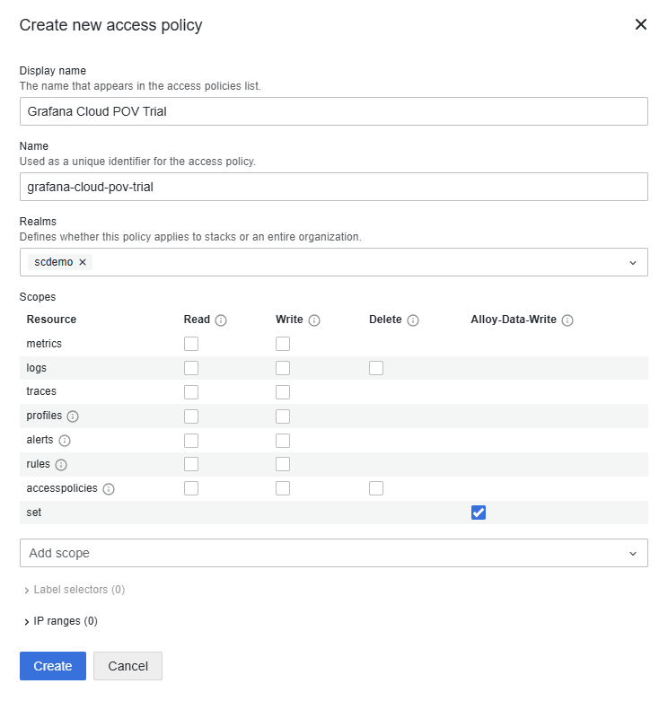
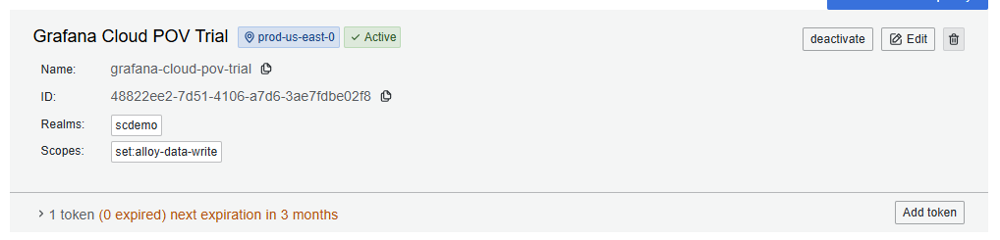
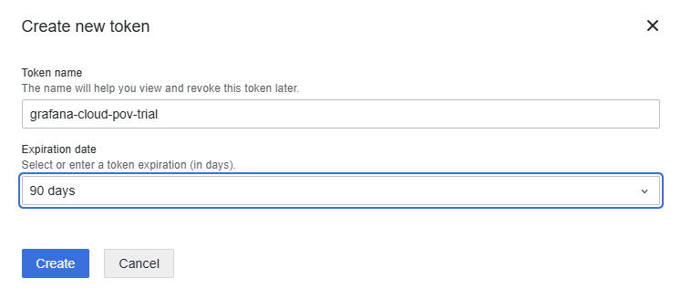

# Path 1 — Direct Deployment (Windows)

Deploy the hardened `config.alloy` directly to each Windows host using standard Windows admin tooling (GPO, SCCM, Intune, PDQ Deploy, manual copy, etc.). The config file lives on the host; there is no remote configuration service.

> Looking for centrally-managed config pushes via Grafana Cloud? See **[Path 2 — Fleet Management](fleet-management.md)**.

## What You Need

### Create an Access Policy and Token

1. Visit your org's access policies page: `https://grafana.com/orgs/YOURORG/access-policies`
2. Click **Create access policy**
3. Give it a descriptive name (e.g. "Grafana Alloy POC")
4. Under **Realms**, select the stack(s) this policy applies to (single stack or all stacks)
5. Skip the scopes checkboxes. Instead, use the **Add scope** dropdown and select **set:alloy-data-write**
6. Click **Create**



7. On the newly created policy, click the **Add token** button in the lower right


8. Give the token a name and set an expiration (e.g. 90 days for a POV)
9. Click **Create**



**Copy the token immediately and save it to a file. You only get one chance to copy it.**

This token is the value you'll use for the `GCLOUD_RW_API_KEY` environment variable below.

### Gather Your Endpoints

From your Grafana Cloud stack (grafana.com > My Account > your stack):

| Value | Example | Where to Find |
|-------|---------|---------------|
| Metrics URL | `https://prometheus-prod-13-prod-us-east-0.grafana.net/api/prom/push` | Prometheus > Details |
| Metrics Username | `000000` | Prometheus > Details |
| Logs URL | `https://logs-prod-006.grafana.net/loki/api/v1/push` | Loki > Details |
| Logs Username | `000000` | Loki > Details |

## Step 1: Install Alloy

Download the Windows installer zip from [Grafana Alloy releases](https://github.com/grafana/alloy/releases) (the `alloy-installer-windows-amd64.exe.zip` file) or the [Grafana downloads page](https://grafana.com/docs/alloy/latest/set-up/install/windows/).

The installer registers Alloy to `C:\Program Files\GrafanaLabs\Alloy\` and creates a Windows service named **Alloy** that starts automatically.

For silent install across your fleet:

```powershell
# Extract and run the installer silently
Expand-Archive -Path alloy-installer-windows-amd64.exe.zip -DestinationPath .\alloy-installer
.\alloy-installer\alloy-installer-windows-amd64.exe /S
```

This works with any deployment tool that can run exe installers (GPO startup scripts, SCCM, Intune, PDQ Deploy, etc.).

## Step 2: Deploy the Config File

The installer drops a default `config.alloy`. Replace it with the hardened config from this repo. Most users do this without cloning — pull the raw file, or copy-paste from the browser:

```powershell
# Download directly from the repo
Invoke-WebRequest `
  -Uri "https://raw.githubusercontent.com/scarolan/hardened-grafana-alloy-windows/main/config.alloy" `
  -OutFile "C:\Program Files\GrafanaLabs\Alloy\config.alloy"
```

Or open the [raw file on GitHub](https://raw.githubusercontent.com/scarolan/hardened-grafana-alloy-windows/main/config.alloy), copy the contents, and paste into `C:\Program Files\GrafanaLabs\Alloy\config.alloy`.

For scale-out, stage the file on a share/repo and distribute via your usual tooling:

| Tool | Method |
|------|--------|
| **GPO** | Group Policy Preferences > Files — copy from a network share (e.g. `\\fileserver\alloy\config.alloy`) to the target path |
| **SCCM / MECM** | Package the config file and deploy it as a program or application |
| **Intune** | Wrap the file copy in a Win32 app or use a remediation script |
| **PDQ Deploy** | Add a "Copy File" step pointing to a central share |
| **Manual / small fleet** | `Copy-Item` via PowerShell remoting or `robocopy` from a share |

This config includes five layers of cardinality protection that reduce metric volume by ~90% compared to a default install. A typical server sends 200-500 series instead of 1,500-3,000+.

## Step 3: Set Environment Variables

The config reads all credentials from system environment variables, so nothing sensitive lives in the config file itself. Set these as **Machine-level** environment variables on each server:

```powershell
[System.Environment]::SetEnvironmentVariable("GCLOUD_RW_API_KEY", "glc_xxxxxxxxxxxxx", "Machine")
[System.Environment]::SetEnvironmentVariable("GRAFANA_METRICS_URL", "https://prometheus-prod-13-prod-us-east-0.grafana.net/api/prom/push", "Machine")
[System.Environment]::SetEnvironmentVariable("GRAFANA_METRICS_USERNAME", "000000", "Machine")
[System.Environment]::SetEnvironmentVariable("GRAFANA_LOGS_URL", "https://logs-prod-006.grafana.net/loki/api/v1/push", "Machine")
[System.Environment]::SetEnvironmentVariable("GRAFANA_LOGS_USERNAME", "000000", "Machine")
```

**For fleet deployment via GPO:**

1. Open Group Policy Management Console
2. Navigate to Computer Configuration > Preferences > Windows Settings > Environment
3. Create a new environment variable for each of the five values above
4. Set Action to "Replace" and target to "Machine"

The same variables work with SCCM, Intune, or any tool that can set system environment variables.

## Step 4: Restart the Service

After the config and environment variables are in place:

```powershell
Restart-Service Alloy
```

For GPO deployments, a scheduled task or startup script handles this. The service also picks up changes on reboot.

## Step 5: Verify and Import the Dashboard

After a few minutes, metrics should appear in your Grafana Cloud stack. Import [**Dashboard ID 24390**](https://grafana.com/grafana/dashboards/24390-windows-exporter-dashboard-2025/) (Windows Exporter Dashboard 2025) to visualize everything the hardened config collects.

To verify from any server:

```powershell
# Check service is running
Get-Service Alloy

# Check Alloy logs for errors
Get-WinEvent -LogName Application -ProviderName Alloy -MaxEvents 20
```

## Summary

| Step | What | How (at scale) |
|------|------|----------------|
| 1 | Install Alloy | GPO startup script / SCCM / Intune |
| 2 | Deploy config.alloy | File copy via GPO Preferences / SCCM package |
| 3 | Set env vars | GPO Preferences > Environment Variables |
| 4 | Restart service | Startup script or scheduled task |
| 5 | Import dashboard | One-time, in Grafana Cloud UI |

All five steps use standard Windows admin tooling. No PowerShell scripts to run interactively on each box. When a config change is needed, you redeploy the file — there is no centralized config push.
